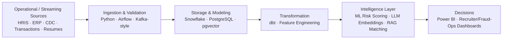

# Hi, I'm Sai Deva Puttur 👋

### Data Engineer — AI-Enabled Systems · Banking & Finance · Health Analytics

---

## About Me

I build governed, production-grade data platforms and layer AI/LLM systems on top of them — currently focused on **AI-enabled data products**, **banking & financial analytics**, and **health & workforce data engineering**. I care more about pipelines and models that hold up in production than about listing every tool I've touched.

- **Currently building:** an AI-powered candidate screening agent (LLM + vector search) and an enterprise workforce & revenue data warehouse on Snowflake + dbt + Airflow
- **Domains:** AI/LLM Data Systems · Banking & Financial Services · Health & Public Sector · Finance & Workforce Analytics
- **Core stack:** Python · SQL · Snowflake · dbt · Apache Airflow · PostgreSQL · pgvector · LLM APIs
- Actively seeking **Data Engineer** and **AI-enabled Data Engineer** roles

---

## Tech Stack

**AI & LLM Systems**

**Cloud & Data Platforms**

**Languages & Data**

**Engineering & DevOps**

---

## Featured Projects

### 🤖 AI-Enabled Data Systems

#### [AI Recruitment Screening Agent](https://github.com/Saideva0318/ai-recruitment-screening-agent)
   

LLM-powered candidate screening system: parses resumes and job descriptions, generates embeddings, semantically ranks candidates with pgvector similarity search, and produces an explainable match report (matched skills, missing skills, experience evidence) for recruiters.

**Stack:** Python · LLM Embeddings · pgvector · PostgreSQL · SQLAlchemy · Docker · pytest · GitHub Actions

---

### 🏦 Banking & Financial Services

#### [Real-Time Banking Fraud Detection Pipeline](https://github.com/Saideva0318/banking-fraud-detection-pipeline)
   

Simulated card/ATM/mobile transaction stream with sliding-window feature engineering (velocity, amount z-score, geo jumps), a rule engine plus ML anomaly/risk scoring model, and flagged-transaction storage feeding a fraud-ops dashboard.

**Stack:** Python · Pandas · scikit-learn · PostgreSQL · Kafka-style streaming simulation · Docker · pytest

---

### 🏥 Health & Public Sector Data Engineering

#### [Public Health Dashboard Pipeline](https://github.com/Saideva0318/public-health-dashboard-pipeline)
  

End-to-end pipeline transforming CDC open data into analytics-ready PostgreSQL tables and interactive Power BI surveillance dashboards — disease trend analysis, geographic breakdowns, demographic splits, and data-completeness KPIs for health analysts and decision-makers.

**Stack:** Python · PostgreSQL · SQL · Power BI · Apache Airflow (optional)

---

### 💼 Finance & Workforce Analytics

#### [Workforce & Revenue Analytics Data Platform](https://github.com/Saideva0318/workforce-revenue-analytics-platform)
   

Enterprise-grade cloud data warehouse consolidating HRIS, ATS, ERP, timesheet, and CRM source systems into a single governed Snowflake environment. Star-schema warehouse replacing spreadsheet-based reporting for HR, Talent Acquisition, and Finance teams.

**Stack:** Snowflake · dbt · Apache Airflow · Python 3.11 · Great Expectations · Terraform · Power BI · GitHub Actions

<strong>More projects</strong> (core data engineering & ML)

 

**[ETL Pipeline — CSV/API → PostgreSQL](https://github.com/Saideva0318/etl-pipeline-postgres)** — Containerized ETL with data-quality validation, APScheduler scheduling, and GitHub Actions CI against a real PostgreSQL service. `Python · PostgreSQL · Docker · pytest`

**[Real Estate Analytics Pipeline](https://github.com/Saideva0318/real-estate-analytics-pipeline)** — Buildium API/Excel ingestion into AWS S3, orchestrated with Airflow, modeled in Snowflake, visualized in Power BI. `AWS S3 · Airflow · Snowflake · Power BI`

**[Customer Churn Prediction](https://github.com/Saideva0318/customer-churn-analysis)** — Telecom churn ML pipeline (Logistic Regression, Random Forest, XGBoost + SMOTE), 87% ROC-AUC. `Python · Scikit-learn · XGBoost`

**[Sales Performance Analysis Dashboard](https://github.com/Saideva0318/sales-performance-dashboard)** — Interactive KPI dashboard over 5,000 sales records with YoY growth and CLTV segmentation. `Python · Pandas · Plotly/Dash · SQL`

**[E-commerce Product Trend Analysis](https://github.com/Saideva0318/ecommerce-product-trend-analysis)** — Market basket analysis and composite scoring on live REST API data. `Python · Pandas · mlxtend · Plotly`

---

## GitHub Dashboard

---

## What I Build

---

## Let's Connect

- LinkedIn: [linkedin.com/in/saideva](https://www.linkedin.com/in/sai-deva-puttur/)
- GitHub: [github.com/Saideva0318](https://github.com/Saideva0318)
- Location: NYC Metro Area · Edison, NJ · Open to Hybrid & Remote

---

*"Building data and AI pipelines that turn raw noise into business signal."*

